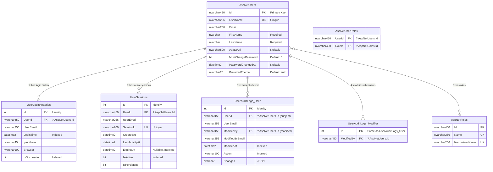
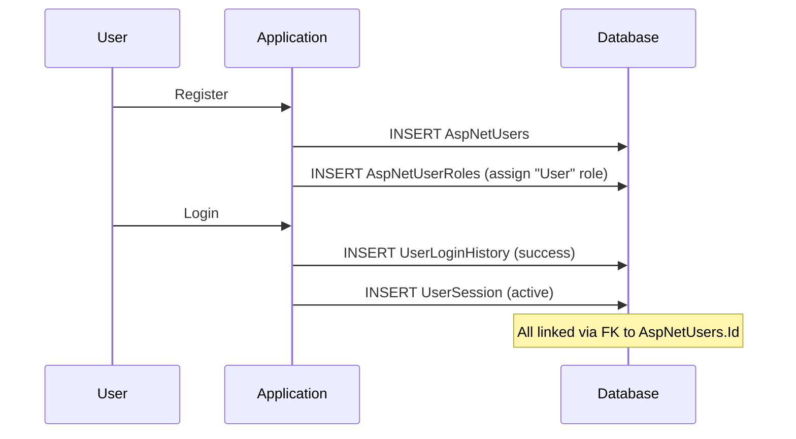
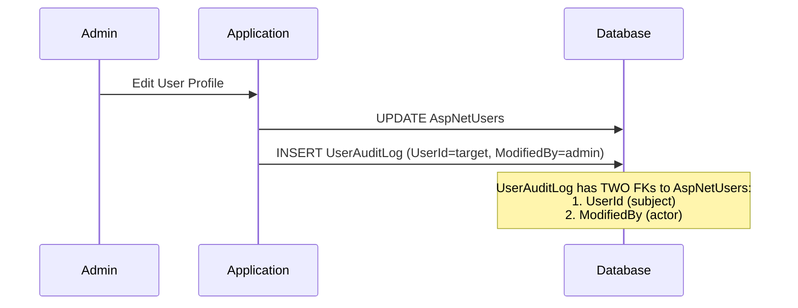
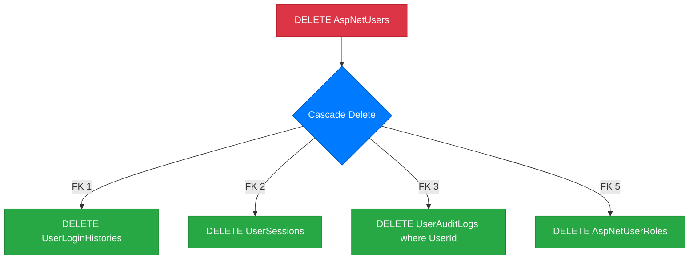

# ?? Kompletny diagram wszystkich relacji

## ?? Wszystkie 5 relacji w jednym miejscu



---

## ?? Szczegó³y ka¿dej relacji

### 1?? **ApplicationUser ? UserLoginHistory** ? WDRO¯ONE
```
AspNetUsers (1) ?????< UserLoginHistories (?)
   Id        UserId (FK)
```
- **FK**: `FK_UserLoginHistories_AspNetUsers_UserId`
- **Delete**: CASCADE
- **Status**: ? Zaimplementowane (2024-11-01 10:11)

**Zastosowanie:**
- Historia logowañ u¿ytkownika
- Security audit
- Wykrywanie ataków brute-force

---

### 2?? **ApplicationUser ? UserSession** ? WDRO¯ONE
```
AspNetUsers (1) ?????< UserSessions (?)
       Id     UserId (FK)
```
- **FK**: `FK_UserSessions_AspNetUsers_UserId`
- **Delete**: CASCADE
- **Status**: ? Zaimplementowane (2024-11-01 11:25)

**Zastosowanie:**
- Zarz¹dzanie aktywnymi sesjami
- Wylogowanie z wszystkich urz¹dzeñ
- Session hijacking prevention

---

### 3?? **ApplicationUser ? UserAuditLog (podmiot)** ? TODO
```
AspNetUsers (1) ?????< UserAuditLogs (?)
        Id          UserId (FK)
```
- **FK**: `FK_UserAuditLogs_AspNetUsers_UserId` ? DO UTWORZENIA
- **Delete**: CASCADE (zalecane)
- **Status**: ? Do implementacji

**Zastosowanie:**
- Historia zmian konta u¿ytkownika
- RODO/GDPR compliance
- Audyt modyfikacji danych osobowych

---

### 4?? **ApplicationUser ? UserAuditLog (modyfikator)** ? TODO
```
AspNetUsers (1) ?????< UserAuditLogs (?)
   Id   ModifiedBy (FK)
```
- **FK**: `FK_UserAuditLogs_AspNetUsers_ModifiedBy` ? DO UTWORZENIA
- **Delete**: RESTRICT lub NO_ACTION (zalecane)
- **Status**: ? Do implementacji

**?? UWAGA**: To druga relacja miêdzy tymi samymi tabelami!

**Zastosowanie:**
- Œledzenie KTO dokona³ zmian
- Audyt administratorów
- Accountability & compliance

---

### 5?? **ApplicationUser ? IdentityRole (Many-to-Many)** ?? CZÊŒCIOWO
```
AspNetUsers (?) ???? AspNetUserRoles ???? AspNetRoles (?)
```
- **FK 1**: `FK_AspNetUserRoles_AspNetUsers_UserId` ? Istnieje (Identity)
- **FK 2**: `FK_AspNetUserRoles_AspNetRoles_RoleId` ? Istnieje (Identity)
- **Status**: ?? FK istniej¹, brak navigation properties

**Zastosowanie:**
- System ról i autoryzacji
- Hierarchia: User ? Moderator ? Admin ? SuperAdmin
- Kontrola dostêpu

---

## ?? Wszystkie Foreign Keys

| # | FK Name | Child Table | Parent Table | Delete Behavior | Status |
|---|---------|-------------|--------------|-----------------|--------|
| 1 | `FK_UserLoginHistories_AspNetUsers_UserId` | UserLoginHistories | AspNetUsers | CASCADE | ? |
| 2 | `FK_UserSessions_AspNetUsers_UserId` | UserSessions | AspNetUsers | CASCADE | ? |
| 3 | `FK_UserAuditLogs_AspNetUsers_UserId` | UserAuditLogs | AspNetUsers | CASCADE | ? |
| 4 | `FK_UserAuditLogs_AspNetUsers_ModifiedBy` | UserAuditLogs | AspNetUsers | NO_ACTION | ? |
| 5a | `FK_AspNetUserRoles_AspNetUsers_UserId` | AspNetUserRoles | AspNetUsers | CASCADE | ? |
| 5b | `FK_AspNetUserRoles_AspNetRoles_RoleId` | AspNetUserRoles | AspNetRoles | CASCADE | ? |

**Postêp**: 4/6 FK (66.7%)

---

## ?? Wizualizacja przep³ywu danych

### Scenariusz 1: Rejestracja i logowanie u¿ytkownika


### Scenariusz 2: Admin modyfikuje u¿ytkownika


### Scenariusz 3: Usuniêcie u¿ytkownika (Cascade Delete)


**?? UWAGA**: UserAuditLog gdzie `ModifiedBy` = deleted user **NIE zostanie usuniêty** (NO_ACTION)

---

## ?? Porównanie Navigation Properties

### Zaimplementowane (2/5)
```csharp
// ApplicationUser.cs
public virtual ICollection<UserLoginHistory> LoginHistories { get; set; }  // ?
public virtual ICollection<UserSession> Sessions { get; set; }             // ?
```

### Do zaimplementowania (3/5)
```csharp
// ApplicationUser.cs
public virtual ICollection<UserAuditLog> AuditLogs { get; set; }     // ? TODO
public virtual ICollection<UserAuditLog> ModifiedAuditLogs { get; set; }   // ? TODO
public virtual ICollection<IdentityRole> Roles { get; set; }               // ? TODO (optional)
```

---

## ?? Bezpieczeñstwo i integralnoœæ

### ? Co ju¿ dzia³a:
- Nie mo¿na dodaæ UserLoginHistory bez istniej¹cego UserId
- Nie mo¿na dodaæ UserSession bez istniej¹cego UserId
- Usuniêcie u¿ytkownika automatycznie usuwa jego historie i sesje
- Role system dzia³a przez ASP.NET Identity

### ? Co zosta³o do zrobienia:
- Audyt zmian u¿ytkowników (UserAuditLog podmiot)
- Tracking administratorów (UserAuditLog modyfikator)
- Navigation properties dla ról (opcjonalne)

---

## ?? Przyk³ady u¿ycia LINQ

### Z ju¿ zaimplementowanymi relacjami (?):
```csharp
// 1. U¿ytkownik z histori¹ logowañ
var user = await _context.Users
    .Include(u => u.LoginHistories)
    .Include(u => u.Sessions.Where(s => s.IsActive))
  .FirstOrDefaultAsync(u => u.Id == userId);

Console.WriteLine($"User: {user.UserName}");
Console.WriteLine($"Total logins: {user.LoginHistories.Count}");
Console.WriteLine($"Active sessions: {user.Sessions.Count}");

// 2. Ostatnie logowania z informacj¹ o u¿ytkowniku
var recentLogins = await _context.UserLoginHistories
    .Include(h => h.User)
    .Where(h => h.LoginTime >= DateTime.UtcNow.AddDays(-7))
    .OrderByDescending(h => h.LoginTime)
    .ToListAsync();

foreach (var login in recentLogins)
{
    Console.WriteLine($"{login.User.UserName} logged in at {login.LoginTime}");
}
```

### Po zaimplementowaniu UserAuditLog (?):
```csharp
// 3. U¿ytkownik z pe³n¹ histori¹ zmian
var userWithAudit = await _context.Users
 .Include(u => u.AuditLogs)    // Zmiany tego u¿ytkownika
    .Include(u => u.ModifiedAuditLogs)  // Zmiany przez tego u¿ytkownika
 .FirstOrDefaultAsync(u => u.Id == userId);

// 4. Audyt: Kto zmieni³ profil u¿ytkownika?
var profileChanges = await _context.UserAuditLogs
    .Include(a => a.User)       // Podmiot zmiany
    .Include(a => a.Modifier)     // Kto dokona³ zmiany
  .Where(a => a.UserId == targetUserId)
    .OrderByDescending(a => a.ModifiedAt)
    .ToListAsync();

foreach (var change in profileChanges)
{
    Console.WriteLine($"{change.Modifier.UserName} modified {change.User.UserName} at {change.ModifiedAt}");
    Console.WriteLine($"Action: {change.Action}");
}
```

---

## ?? Testy do wykonania

### Dla ka¿dej relacji sprawdŸ:

#### ? Test 1: Eager Loading
```csharp
var result = await _context.Users
    .Include(u => u.NavigationProperty)
    .FirstOrDefaultAsync();

Assert.NotNull(result.NavigationProperty);
```

#### ? Test 2: Foreign Key Constraint
```csharp
// Próba dodania z nieistniej¹cym UserId
await Assert.ThrowsAsync<DbUpdateException>(() => 
    _context.ChildTable.AddAsync(invalidRecord)
);
```

#### ? Test 3: Cascade Delete
```csharp
await _userManager.DeleteAsync(user);

var orphans = await _context.ChildTable
    .Where(c => c.UserId == user.Id)
    .ToListAsync();

Assert.Empty(orphans);
```

---

## ?? Nastêpne kroki

### Priorytet 1: UserAuditLog (obie relacje)
1. Dodaj navigation properties
2. Skonfiguruj multiple relationships w DbContext
3. Utwórz migracjê
4. Zastosuj do bazy
5. Przetestuj

**Szacowany czas**: ~25-30 minut

### Priorytet 2: IdentityRole (opcjonalne)
1. Dodaj navigation properties (jeœli potrzebne)
2. Dokumentacja

**Szacowany czas**: ~10 minut

---

**Ostatnia aktualizacja**: 2024-11-01  
**Postêp**: 40% (2/5 g³ównych relacji)  
**FK utworzonych**: 4/6 (66.7%)  
**Status**: ?? W trakcie implementacji
