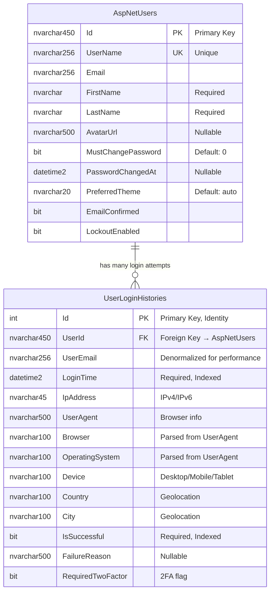
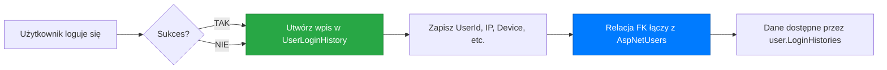
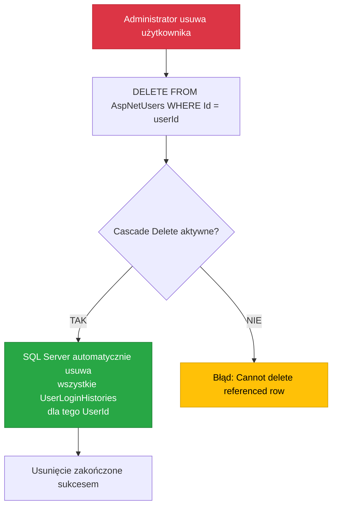

# 📊 Diagram relacji ApplicationUser → UserLoginHistory

## 🎯 Relacja One-to-Many (1:∞)



---

## 📋 Szczegóły relacji

| Właściwość | Wartość |
|------------|---------|
| **Typ relacji** | One-to-Many (1:∞) |
| **Tabela nadrzędna** | `AspNetUsers` (ApplicationUser) |
| **Tabela podrzędna** | `UserLoginHistories` |
| **Foreign Key** | `UserLoginHistories.UserId` → `AspNetUsers.Id` |
| **Constraint Name** | `FK_UserLoginHistories_AspNetUsers_UserId` |
| **On Delete** | `CASCADE` - usuwa historię razem z użytkownikiem |
| **On Update** | `NO ACTION` - nie propaguje zmian (Id się nie zmienia) |
| **Required** | TAK - każdy wpis musi mieć UserId |
| **Indexed** | TAK - automatyczny indeks na FK |

---

## 🔑 Klucze i indeksy

### Primary Keys
- **AspNetUsers**: `Id` (nvarchar(450))
- **UserLoginHistories**: `Id` (int, IDENTITY)

### Foreign Keys
- **UserLoginHistories.UserId** → **AspNetUsers.Id**

### Indeksy na UserLoginHistories
```sql
-- Automatyczny indeks na Foreign Key
IX_UserLoginHistories_UserId (UserId)

-- Dodatkowe indeksy dla wydajności
IX_UserLoginHistories_LoginTime (LoginTime)
IX_UserLoginHistories_IsSuccessful (IsSuccessful)
```

---

## 💾 Właściwości nawigacyjne w C#

### W klasie `ApplicationUser`
```csharp
/// <summary>
/// Kolekcja wszystkich prób logowania użytkownika
/// </summary>
public virtual ICollection<UserLoginHistory> LoginHistories { get; set; } = new List<UserLoginHistory>();
```

### W klasie `UserLoginHistory`
```csharp
/// <summary>
/// Użytkownik, którego dotyczy wpis historii
/// </summary>
[ForeignKey(nameof(UserId))]
public virtual ApplicationUser? User { get; set; }
```

---

## 📊 Diagram przepływu danych



---

## 🔄 Cascade Delete - Diagram



---

## 📈 Przykładowe zapytania z JOIN

### Query 1: Wszystkie logowania użytkownika
```sql
SELECT 
    u.UserName,
    u.Email,
    lh.LoginTime,
    lh.IpAddress,
    lh.IsSuccessful,
    lh.FailureReason
FROM 
    AspNetUsers u
INNER JOIN 
    UserLoginHistories lh ON u.Id = lh.UserId
WHERE 
    u.Id = @userId
ORDER BY 
    lh.LoginTime DESC;
```

### Query 2: Statystyki logowań per użytkownik
```sql
SELECT 
    u.UserName,
    u.Email,
    COUNT(*) AS TotalLogins,
    SUM(CASE WHEN lh.IsSuccessful = 1 THEN 1 ELSE 0 END) AS SuccessfulLogins,
SUM(CASE WHEN lh.IsSuccessful = 0 THEN 1 ELSE 0 END) AS FailedLogins,
    MAX(lh.LoginTime) AS LastLoginTime
FROM 
    AspNetUsers u
LEFT JOIN 
    UserLoginHistories lh ON u.Id = lh.UserId
GROUP BY 
    u.UserName, u.Email
ORDER BY 
    TotalLogins DESC;
```

### Query 3: Niepowodzenia logowania (Security Audit)
```sql
SELECT 
    u.UserName,
    u.Email,
    lh.LoginTime,
    lh.IpAddress,
  lh.FailureReason,
    lh.Browser,
    lh.Country
FROM 
    UserLoginHistories lh
INNER JOIN 
    AspNetUsers u ON lh.UserId = u.Id
WHERE 
    lh.IsSuccessful = 0
    AND lh.LoginTime >= DATEADD(day, -7, GETUTCDATE())
ORDER BY 
    lh.LoginTime DESC;
```

---

## 🎨 Wizualizacja w Visual Studio Database Diagram

Jeśli tworzysz diagram w Visual Studio:

1. **Dodaj obie tabele:**
   - Prawy przyciak → "Add Table"
   - Wybierz: `AspNetUsers` i `UserLoginHistories`

2. **Relacja pojawi się automatycznie:**
   - Linia łącząca `AspNetUsers.Id` → `UserLoginHistories.UserId`
   - Symbol "1" po stronie `AspNetUsers`
   - Symbol "∞" po stronie `UserLoginHistories`

3. **Właściwości relacji:**
   - Kliknij na linię relacji
   - W Properties zobaczysz:
     - **Name**: FK_UserLoginHistories_AspNetUsers_UserId
     - **Delete Rule**: Cascade
     - **Update Rule**: No Action

---

## 🧪 Testy do wykonania

### Test 1: Eager Loading
```csharp
var user = await _context.Users
    .Include(u => u.LoginHistories)
    .FirstOrDefaultAsync(u => u.Id == userId);

Assert.NotNull(user);
Assert.NotNull(user.LoginHistories);
```

### Test 2: Foreign Key Constraint
```csharp
var invalidHistory = new UserLoginHistory
{
    UserId = "nonexistent-user-id",
    // ... inne właściwości
};

_context.UserLoginHistories.Add(invalidHistory);

// To POWINNO rzucić wyjątek:
await Assert.ThrowsAsync<DbUpdateException>(
    () => _context.SaveChangesAsync()
);
```

### Test 3: Cascade Delete
```csharp
var user = new ApplicationUser { /* ... */ };
await _userManager.CreateAsync(user);

var history = new UserLoginHistory { UserId = user.Id, /* ... */ };
_context.UserLoginHistories.Add(history);
await _context.SaveChangesAsync();

// Usuń użytkownika
await _userManager.DeleteAsync(user);

// Historia powinna być automatycznie usunięta
var deletedHistory = await _context.UserLoginHistories
    .FirstOrDefaultAsync(h => h.UserId == user.Id);

Assert.Null(deletedHistory);
```

---

## 📝 Notatki końcowe

### ✅ Dlaczego ta relacja jest ważna?

1. **Bezpieczeństwo** 🔒
   - Śledzenie podejrzanych prób logowania
   - Wykrywanie ataków brute-force
   - Audyt dostępu do systemu

2. **Zgodność z regulacjami** 📋
   - RODO/GDPR wymaga logowania dostępu do danych osobowych
   - SOC 2 compliance
   - ISO 27001

3. **User Experience** 👤
   - "Widzieliśmy nowe logowanie z Warszawy..."
   - "Twoje konto zostało zalogowane z nowego urządzenia"
   - Historia aktywności dla użytkownika

4. **Diagnostyka** 🔍
   - Debugowanie problemów z logowaniem
   - Analiza wzorców użytkowania
   - Optymalizacja procesu autoryzacji

### ⚠️ Uwagi bezpieczeństwa

- **Dane wrażliwe**: IP, lokalizacja = dane osobowe (RODO!)
- **Retencja**: Nie przechowuj danych wiecznie (180 dni domyślnie)
- **Szyfrowanie**: Rozważ szyfrowanie IP adresów
- **Dostęp**: Tylko admin i właściciel konta może widzieć historię

---

**Data utworzenia**: 2024-11-01  
**Status**: ✅ WDROŻONE  
**Wersja**: 1.0
