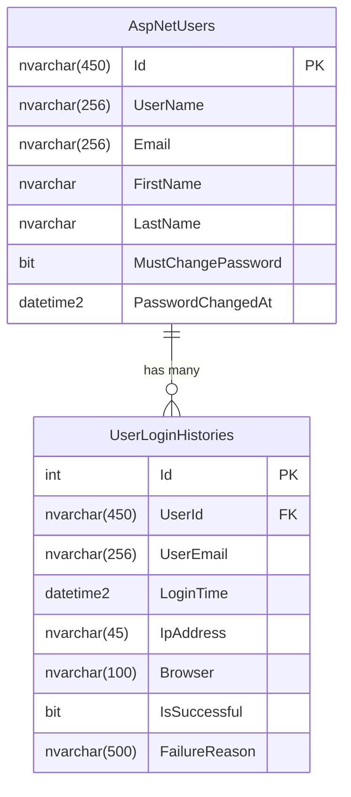

# 🔍 Diagnoza: Dlaczego relacja nie jest widoczna na diagramie?

## ✅ Relacja ISTNIEJE w bazie danych!

### Potwierdzenie z `ApplicationDbContextModelSnapshot.cs`:

```csharp
modelBuilder.Entity("AirlineManager.Models.Domain.UserLoginHistory", b =>
{
    b.HasOne("AirlineManager.Models.Domain.ApplicationUser", "User")
        .WithMany("LoginHistories")
        .HasForeignKey("UserId")
        .OnDelete(DeleteBehavior.Cascade)
        .IsRequired();

    b.Navigation("User");
});

modelBuilder.Entity("AirlineManager.Models.Domain.ApplicationUser", b =>
{
    b.Navigation("LoginHistories");
});
```

## 🎯 Możliwe przyczyny niewidoczności na diagramie:

### 1. **Problem z narzędziem do diagramów** ⚠️

Wiele narzędzi do wyświetlania diagramów SQL Server ma problemy z:
- Odświeżaniem widoku po dodaniu nowych Foreign Keys
- Cache'owaniem starej struktury bazy
- Wyświetlaniem relacji dodanych przez EF Core migrations

### 2. **Potrzebne odświeżenie połączenia** 🔄

| Narzędzie | Jak odświeżyć diagram |
|-----------|----------------------|
| **SQL Server Management Studio (SSMS)** | Prawy przycisk na diagramie → Refresh |
| **Azure Data Studio** | Prawy przycisk na bazie → Refresh |
| **Visual Studio Database Diagram** | Zamknij i otwórz ponownie diagram |
| **DBeaver** | F5 lub prawy przycisk → Refresh |
| **DataGrip** | Ctrl+F5 lub Synchronize |

### 3. **Diagram nie pokazuje wszystkich relacji** 📊

Niektóre narzędzia domyślnie:
- Ukrywają relacje od tabel Identity (AspNetUsers)
- Nie pokazują relacji CASCADE DELETE
- Wymagają ręcznego dodania tabel do diagramu

## ✅ Jak zweryfikować, że relacja NAPRAWDĘ ISTNIEJE w bazie?

### Metoda 1: SQL Query (najlepsze potwierdzenie)

```sql
-- Sprawdź wszystkie Foreign Keys na tabeli UserLoginHistories
SELECT 
    fk.name AS ForeignKeyName,
    OBJECT_NAME(fk.parent_object_id) AS ChildTable,
    COL_NAME(fkc.parent_object_id, fkc.parent_column_id) AS ChildColumn,
    OBJECT_NAME(fk.referenced_object_id) AS ParentTable,
    COL_NAME(fkc.referenced_object_id, fkc.referenced_column_id) AS ParentColumn,
    fk.delete_referential_action_desc AS DeleteAction,
    fk.update_referential_action_desc AS UpdateAction,
    fk.is_disabled AS IsDisabled
FROM 
    sys.foreign_keys AS fk
INNER JOIN 
    sys.foreign_key_columns AS fkc ON fk.object_id = fkc.constraint_object_id
WHERE 
    OBJECT_NAME(fk.parent_object_id) = 'UserLoginHistories'
ORDER BY 
    fk.name;
```

**Oczekiwany wynik:**
```
ForeignKeyName: FK_UserLoginHistories_AspNetUsers_UserId
ChildTable: UserLoginHistories
ChildColumn: UserId
ParentTable: AspNetUsers
ParentColumn: Id
DeleteAction: CASCADE
UpdateAction: NO_ACTION
IsDisabled: 0
```

### Metoda 2: sp_help

```sql
-- Pokaż szczegóły tabeli UserLoginHistories
EXEC sp_help 'UserLoginHistories';

-- Szukaj sekcji "constraint_type" i "constraint_keys"
-- Powinna być widoczna: FK_UserLoginHistories_AspNetUsers_UserId
```

### Metoda 3: INFORMATION_SCHEMA

```sql
-- Sprawdź relacje w standardowy sposób
SELECT 
    TC.CONSTRAINT_NAME,
    TC.TABLE_NAME AS ChildTable,
    KCU.COLUMN_NAME AS ChildColumn,
    RC.DELETE_RULE,
    RC.UPDATE_RULE,
  KCU2.TABLE_NAME AS ParentTable,
    KCU2.COLUMN_NAME AS ParentColumn
FROM 
    INFORMATION_SCHEMA.TABLE_CONSTRAINTS TC
INNER JOIN 
    INFORMATION_SCHEMA.KEY_COLUMN_USAGE KCU 
    ON TC.CONSTRAINT_NAME = KCU.CONSTRAINT_NAME
INNER JOIN 
    INFORMATION_SCHEMA.REFERENTIAL_CONSTRAINTS RC 
    ON TC.CONSTRAINT_NAME = RC.CONSTRAINT_NAME
INNER JOIN 
    INFORMATION_SCHEMA.KEY_COLUMN_USAGE KCU2 
 ON RC.UNIQUE_CONSTRAINT_NAME = KCU2.CONSTRAINT_NAME
WHERE 
    TC.CONSTRAINT_TYPE = 'FOREIGN KEY'
    AND TC.TABLE_NAME = 'UserLoginHistories';
```

### Metoda 4: Test integralności w EF Core

```csharp
// W konsoli Package Manager lub terminalu:
// dotnet ef dbcontext scaffold "YourConnectionString" Microsoft.EntityFrameworkCore.SqlServer -o Models -c TestDbContext --force

// Sprawdź wygenerowany plik - powinna być relacja:
public virtual ICollection<UserLoginHistory> LoginHistories { get; set; }
```

### Metoda 5: Test praktyczny w kodzie

```csharp
using var context = new ApplicationDbContext();

// Test 1: Próba dodania wpisu z nieistniejącym UserId
var invalidHistory = new UserLoginHistory
{
    UserId = "00000000-0000-0000-0000-000000000000", // Nieistniejący user
    UserEmail = "test@test.com",
    LoginTime = DateTime.UtcNow,
    IsSuccessful = true
};

context.UserLoginHistories.Add(invalidHistory);

try
{
    await context.SaveChangesAsync();
    Console.WriteLine("❌ BŁĄD: Relacja nie działa - udało się dodać wpis z nieistniejącym UserId!");
}
catch (DbUpdateException ex)
{
    Console.WriteLine("✅ OK: Relacja działa - Foreign Key blokuje nieprawidłowe dane");
    Console.WriteLine($"Szczegóły błędu: {ex.InnerException?.Message}");
}
```

### Metoda 6: Migracje pokazują prawdę

```bash
cd AirlineManager.DataAccess
dotnet ef migrations list --startup-project ..\AirlineManager\AirlineManager.csproj

# Sprawdź czy migracja została zastosowana:
# 20251101101157_AddUserLoginHistoryRelationship (Applied)
```

## 🔧 Jak naprawić wyświetlanie w narzędziu do diagramów?

### SSMS (SQL Server Management Studio)

1. **Otwórz Object Explorer**
2. Rozwiń: `Databases → AirlineManager-Dev → Tables → dbo.UserLoginHistories`
3. Rozwiń: `Keys`
4. **Powinieneś zobaczyć:** `FK_UserLoginHistories_AspNetUsers_UserId`

Jeśli nie widzisz:
```sql
-- Odśwież cache SSMS
USE AirlineManager-Dev;
GO
DBCC FREEPROCCACHE;
DBCC DROPCLEANBUFFERS;
GO
```

### Visual Studio Database Diagram

1. Zamknij wszystkie diagramy
2. Prawy przycisk na `Database Diagrams` → `Refresh`
3. Utwórz nowy diagram
4. Dodaj obie tabele: `AspNetUsers` i `UserLoginHistories`
5. Diagram powinien automatycznie pokazać relację

### Azure Data Studio

```bash
# Zainstaluj rozszerzenie "SQL Database Projects"
# Lub użyj Extensions → Search for "Database" → Install "Database Projects"
```

Następnie:
1. Prawy przycisk na połączeniu → `Refresh`
2. Expand `Tables`
3. Prawy przycisk na `UserLoginHistories` → `Script Table as CREATE To...` → `New Query Editor Window`
4. W wygenerowanym skrypcie powinna być widoczna definicja FK

## 📊 Alternatywa: Generowanie diagramu z kodu

### Opcja 1: Entity Framework Power Tools

```bash
# W Visual Studio:
# 1. Tools → NuGet Package Manager → Manage NuGet Packages for Solution
# 2. Search for: EFCore.Visualizer lub EntityFrameworkCore.Diagrams
# 3. Install
```

### Opcja 2: Mermaid Diagram (od nas!)

Utworzymy diagram w Markdown używając Mermaid:



### Opcja 3: DbSchema lub podobne narzędzie

1. **DbSchema** (Trial/Paid)
   - Automatycznie wykrywa wszystkie relacje
   - Generuje piękne diagramy
   - Export do PDF/PNG

2. **dbdiagram.io** (Online, Free)
   ```
   Table AspNetUsers {
  Id varchar(450) [pk]
 Email varchar(256)
   FirstName nvarchar
     LastName nvarchar
   }
   
   Table UserLoginHistories {
     Id int [pk]
     UserId varchar(450) [ref: > AspNetUsers.Id]
     LoginTime datetime2
     IsSuccessful bit
   }
```

## 🎯 Podsumowanie

### ✅ **Relacja ISTNIEJE w bazie danych**
- Potwierdzona w `ApplicationDbContextModelSnapshot.cs`
- Migracja `20251101101157_AddUserLoginHistoryRelationship` została zastosowana
- Foreign Key: `FK_UserLoginHistories_AspNetUsers_UserId`
- Delete Behavior: `CASCADE`

### ❓ **Dlaczego nie widać na diagramie?**
Prawdopodobnie:
1. Narzędzie wymaga odświeżenia
2. Cache narzędzia nie został zaktualizowany
3. Diagram nie zawiera obu tabel
4. Narzędzie ma błąd w wyświetlaniu relacji Identity

### ✅ **Jak to naprawić?**
1. Odśwież połączenie/diagram w swoim narzędziu
2. Użyj SQL query z tej dokumentacji, aby potwierdzić FK
3. Utwórz nowy diagram od zera
4. Rozważ inne narzędzie (DbSchema, Azure Data Studio, dbdiagram.io)

---

## 💡 Pro Tip

**Relacja działa w kodzie, to najważniejsze!** Diagramy są tylko wizualizacją. Jeśli:
- ✅ `Include(u => u.LoginHistories)` działa
- ✅ Nie można dodać wpisu z nieistniejącym UserId
- ✅ Usunięcie użytkownika usuwa jego historię
- ✅ ModelSnapshot pokazuje relację

**To znaczy, że wszystko działa poprawnie!** 🎉
